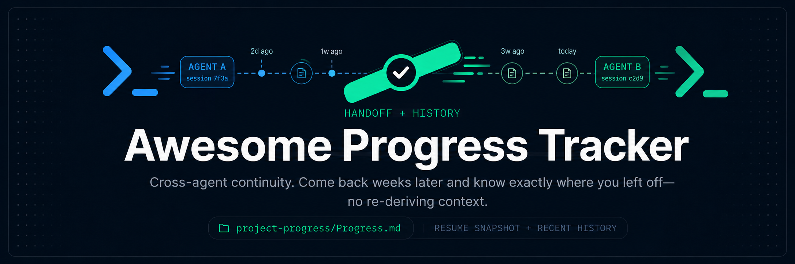

<div align="center">

# Awesome Progress Tracker



### Resumable memory for Codex, Claude Code, and any MCP-compatible agent.

Project-local Markdown that survives context resets — so your agent picks up exactly where it left off, every session, in one file it can read in a few hundred tokens.

[](#license)
[](#choose-your-path)
[](#mcp-server)
[](#choose-your-path)
[](https://github.com/AndriiLavrekha/awesome-progress-tracker/releases/tag/v0.4.1)

[Why](#why) · [Features](#features) · [Quick Start](#choose-your-path) · [MCP Tools](#mcp-server) · [Troubleshooting](#troubleshooting-codex)

</div>

---

## Why

Agent sessions end. Context windows reset. New sessions start cold, and a lot of the first few minutes gets spent re-deriving "what was I doing?" — or worse, redoing it.

Awesome Progress Tracker fixes that with one convention: every project keeps a `project-progress/Progress.md` file as its **resume source of truth**. A `SessionStart` hook injects the compact bits — Resume Snapshot, Next Action, Blockers — into the agent's context automatically. No dashboards, no databases, nothing to sync. Just a Markdown file the agent reads at kickoff and updates before it stops.

```text
session 1 ──work──► Progress.md updated (Resume Snapshot · Next Action · Blockers)
                                │
new session ◄── SessionStart hook injects the snapshot, no lookup needed ──┘
```

## Features

- **🗂️ One file per project, human-readable** — `project-progress/Progress.md` is plain Markdown. Read it, edit it, diff it, commit it.
- **🔁 Automatic resume context** — a `SessionStart` hook injects the Resume Snapshot and Next Action at kickoff, so the agent never starts blind.
- **🛡️ Sensitive-commit guard** — a `PreToolUse` hook blocks `git commit` when staged progress declares `commit_progress: false` or `sensitivity: sensitive`.
- **⏰ Stop reminders** — a `Stop` hook flags when the working tree changed but `Progress.md` didn't, and scans for accidentally-committed secrets.
- **🧩 Works everywhere** — first-class plugins for Claude Code and Codex, plus an open-standard `SKILL.md` skill for Gemini CLI, Copilot, and Cursor.
- **🌐 Cross-project index via MCP** — a lightweight MCP server answers "what am I working on?" across every tracked project, with a tiny, validated tool surface (see [MCP Server](#mcp-server)).
- **🩺 Scriptable health checks** — `doctor --json` gives a non-zero exit code and a diagnostic report when setup is broken, so CI or a pre-flight script can catch it.

## Choose Your Path

| I use... | Install this way |
| --- | --- |
| **Claude Code** | [Install As A Claude Code Plugin](#install-as-a-claude-code-plugin-recommended) — zero-config, one marketplace add |
| **Codex** | [Install As A Codex Plugin](#install-as-a-codex-plugin-recommended) — native plugin flow, no `config.toml` editing |
| **Hermes Agent** | [Install For Hermes Agent](#install-for-hermes-agent) — supported Skill + MCP installation; lifecycle hooks are deferred |
| **Gemini CLI / Copilot / Cursor** | Drop `skills/project-progress/SKILL.md` into `~/.agents/skills` or a repo's `.agents/skills` |
| **MCP client or CLI only** | [Install With npm/npx](#initialize-a-project) and, if needed, [MCP Server](#mcp-server) |

> Requirements: Node.js >= 18. The hooks and MCP server run entirely on Node; no Python is required.

Start a new agent session after plugin installation. Run `awesome-progress-tracker doctor -g codex` or `awesome-progress-tracker doctor --json` for a scriptable setup check.

## Install As A Claude Code Plugin (recommended)

This is the zero-config path: one marketplace add + install wires the skill, the MCP index
server, and lifecycle hooks with no edits to your global `CLAUDE.md` or `~/.claude.json`.

```text
/plugin marketplace add AndriiLavrekha/awesome-progress-tracker
/plugin install project-progress@awesome-progress-tracker
```

Or from the CLI:

```bash
claude plugin marketplace add AndriiLavrekha/awesome-progress-tracker
claude plugin install project-progress@awesome-progress-tracker
```

What you get after install (restart the session to load it):

| Piece | What it does |
| --- | --- |
| **Skill** `project-progress` | Guides the agent to maintain `project-progress/` during work |
| **Command** `/project-progress:init [name]` | Initializes tracking in the current repo |
| **MCP server** `project-progress` | `list/refresh/read/update/mark` tools over a cross-project index |
| **`SessionStart` hook** | Injects the Resume Snapshot / Next Action as context |
| **`PreToolUse` hook** | Blocks `git commit` on staged progress marked `commit_progress: false` or `sensitivity: sensitive` |
| **`Stop` hook** | Reminds you to update progress (and flags secrets) when the tree changed but `Progress.md` didn't |

To scope the MCP index to specific roots, set `PROJECT_PROGRESS_ROOTS` (semicolon-separated)
in the environment Claude Code runs in; the server scans those roots on `refresh_projects`.

> The plugin ships prebuilt `dist/` so it runs straight from the cloned repo with no build step.

## Install As A Codex Plugin (recommended)

The same repo is also a Codex plugin (`.codex-plugin/plugin.json` + `.agents/plugins/marketplace.json`),
so it installs through the native Codex plugin flow — no manual `config.toml` editing:

```bash
codex plugin marketplace add AndriiLavrekha/awesome-progress-tracker
codex plugin add project-progress@awesome-progress-tracker
```

This wires the same **skill**, **MCP server**, and **lifecycle hooks** (`hooks/hooks-codex.json`)
as the Claude Code plugin. Codex hook commands use `${PLUGIN_ROOT}` and the bundled MCP server
uses the Codex-specific `.mcp.codex.json` file. Restart Codex or start a new Codex session after
installing or updating the plugin so the manifest, MCP server, and hooks are reloaded.

> [!NOTE]
> Codex does not auto-trust plugin-bundled hooks: the first time the `SessionStart` / `PreToolUse` /
> `Stop` hooks fire, Codex asks you to review and trust them. Approve once to enable the
> resume-context injection and the sensitive-commit guard.

<details>
<summary><strong>Upgrade the plugin</strong></summary>
<br>

Use the command path that matches how you installed the plugin.

**Codex**

```bash
codex plugin marketplace upgrade
codex plugin add project-progress@awesome-progress-tracker
codex plugin list
```

Codex refreshes configured Git marketplaces with the first command; re-adding the plugin installs
the latest marketplace snapshot. Start a new Codex session afterward. If prompted, review and
trust the updated hooks in `/hooks`.

**Claude Code**

```bash
claude plugin update project-progress@awesome-progress-tracker
claude plugin list
```

Restart Claude Code after the update so the plugin's skills, MCP server, and hooks reload.

</details>

Codex hooks are lifecycle context, not interactive modals. On an initialized project,
`SessionStart` injects compact resume context from `project-progress/Progress.md`. On an
uninitialized project, it emits guidance telling the agent to ask before initialization when the
requested work is multi-step. The agent and skill perform the user-facing ask:

```text
This project is not initialized with Awesome Progress Tracker. Do you want me to create `project-progress/` here?
```

If you answer yes, the agent should run `awesome-progress-tracker init . --project "<name>"` or
`project-progress init . --project "<name>"`. If you answer no, the agent should record a local
per-project opt-out so future sessions stay quiet:

```bash
awesome-progress-tracker state set . --state opted-out
```

The opt-out is stored outside the repository under the Awesome Progress Tracker user data directory;
it does not dirty the project.

Skills follow the cross-tool open standard (`SKILL.md`), so the same skill also works in Codex,
Gemini CLI, Copilot, and Cursor when placed under `~/.agents/skills` or a repo's `.agents/skills`.

## Install For Hermes Agent

Hermes Agent is supported today through the managed skill + MCP path. The current Hermes integration
supports the `install`, `doctor`, and `uninstall` commands, plus `status` for inspection.
lifecycle hooks are deferred for Hermes, so this path does not yet wire `SessionStart`,
`PreToolUse`, or `Stop` automation.

If Hermes itself is not installed yet:

```bash
npm install -g hermes
```

If you prefer to keep this package available to Hermes globally, you can also install the package
with:

```bash
hermes install -g github:AndriiLavrekha/awesome-progress-tracker
```

To wire the supported managed integration, run:

```bash
npx github:AndriiLavrekha/awesome-progress-tracker install -g hermes
```

What this Hermes path manages today:

| Piece | What it does |
| --- | --- |
| **Skill** `project-progress` | Installs the shared `SKILL.md` into Hermes from the tagged raw GitHub URL |
| **MCP server** `awesome-progress-tracker` | Adds the stdio MCP server through `hermes mcp add ...` with `PROJECT_PROGRESS_ROOTS` |
| **Doctor** | Verifies Hermes CLI availability, skill presence, MCP presence, and `hermes mcp test awesome-progress-tracker` connectivity |
| **Uninstall** | Removes only the managed Hermes skill and MCP server |

Named collisions stop the install before any changes are made. If Hermes already has a
`project-progress` skill or `awesome-progress-tracker` MCP server, remove or rename the existing
entry first and rerun the installer.

After install or update, restart Hermes after install or update so it reloads the managed skill and
MCP registry.

Because lifecycle hooks are deferred for Hermes, use the skill and MCP tools directly for now:

- initialize with `awesome-progress-tracker init . --project "<name>"` when the user opts in
- inspect setup with `awesome-progress-tracker status -g hermes` or `awesome-progress-tracker doctor -g hermes`
- use `hermes skills list --source hub`, `hermes mcp list`, and `hermes mcp test awesome-progress-tracker` for manual verification

## Initialize A Project

After npm publication:

```bash
npx awesome-progress-tracker init /path/to/repo --project "My Project"
```

From the private GitHub repository:

```bash
npx github:AndriiLavrekha/awesome-progress-tracker init /path/to/repo --project "My Project"
```

Or install it globally:

```bash
npm install -g github:AndriiLavrekha/awesome-progress-tracker
project-progress init /path/to/repo --project "My Project"
```

The `init` command creates `project-progress/` from `templates/project-progress/`. Then update `project-progress/Progress.md` frontmatter and sections for that project. Keep `Resume Snapshot`, `Next Action`, `Remaining Work`, and `Blockers` compact enough for an agent to load first.

<details>
<summary><strong>Agent Instructions — manual / CLI install path</strong></summary>
<br>

Install the global bootstrap for the agent you use.

Claude Code is the default:

```bash
npx github:AndriiLavrekha/awesome-progress-tracker install
npx github:AndriiLavrekha/awesome-progress-tracker install -g claude
```

Codex:

```bash
npx github:AndriiLavrekha/awesome-progress-tracker install -g codex
```

The installer does not initialize every project automatically. It installs global bootstrap instructions that tell the agent to check for `project-progress/Progress.md` at kickoff. If the current project is not initialized, the agent must ask before creating `project-progress/`.

The installer also configures the selected agent's MCP client to run this package:

- Claude Code: updates `~/.claude.json`.
- Codex: updates `~/.codex/config.toml`.

By default, the MCP server scans the directory where you ran `install`. To scan other roots:

```bash
npx github:AndriiLavrekha/awesome-progress-tracker install -g codex --roots "C:/Users/me/Documents;C:/Users/me/Projects"
```

Check installation state:

```bash
npx github:AndriiLavrekha/awesome-progress-tracker status
npx github:AndriiLavrekha/awesome-progress-tracker status -g codex
```

Inspect or reset per-project opt-in/opt-out state:

```bash
npx github:AndriiLavrekha/awesome-progress-tracker state list
npx github:AndriiLavrekha/awesome-progress-tracker state set /path/to/repo --state opted-out
npx github:AndriiLavrekha/awesome-progress-tracker state reset /path/to/repo
```

Run a setup health check:

```bash
npx github:AndriiLavrekha/awesome-progress-tracker doctor
npx github:AndriiLavrekha/awesome-progress-tracker doctor -g codex
```

Install and immediately verify:

```bash
npx github:AndriiLavrekha/awesome-progress-tracker install --verify
npx github:AndriiLavrekha/awesome-progress-tracker install -g codex --verify
```

Install only the MCP configuration, without bootstrap instructions:

```bash
npx github:AndriiLavrekha/awesome-progress-tracker install-mcp
npx github:AndriiLavrekha/awesome-progress-tracker install-mcp -g codex
```

Write a project-local MCP config instead of user-global config:

```bash
npx github:AndriiLavrekha/awesome-progress-tracker install-mcp --local --roots "."
```

This writes `.mcp.json` in the current project.

Remove managed bootstrap and MCP config:

```bash
npx github:AndriiLavrekha/awesome-progress-tracker uninstall
npx github:AndriiLavrekha/awesome-progress-tracker uninstall -g codex
npx github:AndriiLavrekha/awesome-progress-tracker uninstall --local
```

Manual instruction files are also available:

- install or reference `skills/project-progress/SKILL.md` for Codex
- paste `agent-instructions/AGENTS-snippet.md` into a project or global AGENTS.md
- paste `agent-instructions/CLAUDE-snippet.md` into Claude Code memory
- follow `agent-instructions/HOOKS.md` for lifecycle reminders and validation

Agents should update progress at kickoff when state changes, after milestones, when blockers appear, after verification, and before ending a meaningful session.

</details>

<details>
<summary><strong>Hook Check — run the lifecycle hook manually</strong></summary>
<br>

**Windows**

```powershell
./hooks/project-progress-check.ps1 -ProjectRoot . -SessionStartedAt 2026-06-27T00:00:00+00:00 -MeaningfulWork -CompletionBoundary
```

**POSIX**

```bash
./hooks/project-progress-check.sh --project-root . --session-started-at 2026-06-27T00:00:00+00:00 --meaningful-work --completion-boundary
```

The wrappers run the compiled hook (`dist/src/hook/cli.js`) on Node, so run `npm run build` (or
install the published package, which builds on `prepare`) before invoking them. For direct use
without the wrappers, call `node dist/src/hook/cli.js --project-root . --session-started-at <iso>`.

</details>

## MCP Server

After npm publication:

```bash
npx awesome-progress-tracker mcp
```

From the private GitHub repository:

```bash
npx github:AndriiLavrekha/awesome-progress-tracker mcp
```

Configure discovery with a semicolon-separated `PROJECT_PROGRESS_ROOTS` value:

```powershell
$env:PROJECT_PROGRESS_ROOTS = "C:/Users/you/Documents;C:/Users/you/Projects"
npx github:AndriiLavrekha/awesome-progress-tracker mcp
```

For local development in this repo:

```bash
npm install
npm run build:mcp
node dist/src/mcp/server.js
```

For MCP clients installed from npm or GitHub, use the package binary directly (`awesome-progress-tracker mcp` or `project-progress mcp`) so stdio output stays clean.

**Tool surface** — deliberately small; administrative tracking state lives in the CLI (`state list/set/reset`), not here:

| Tool | What it does |
| --- | --- |
| `list_projects` | List compact summaries from the cached index; optional `status` filter |
| `refresh_projects` | Rescan `PROJECT_PROGRESS_ROOTS` for `project-progress/Progress.md` files and update the index |
| `read_project_progress` | Read one project's compact progress summary |
| `update_project_progress` | Replace or append a named section in a project's `Progress.md` |
| `mark_project_status` | Update frontmatter `status` and `last_milestone` for a project |

The MCP server maintains a lightweight global index:

```text
~/.awesome-progress-tracker/projects.json
~/.awesome-progress-tracker/Projects.md
```

`project-progress/Progress.md` remains the source of truth. The index is only a fast global view for "what projects exist?" queries. `refresh_projects` rescans `PROJECT_PROGRESS_ROOTS` and updates the index. `init`, `update_project_progress`, and `mark_project_status` also upsert the affected project into the index.

## Verification

<details>
<summary><strong>Manual and agent-led validation commands</strong></summary>
<br>

For manual and agent-led validation, use:

- `TESTING.md`
- `agent-instructions/SELF-TEST.md`

Run the tests and build:

```bash
npm test
npm run build
```

Verify package creation and npx-style execution locally:

```bash
npm pack --dry-run
npm pack
npx --yes ./awesome-progress-tracker-0.1.0.tgz help
```

Run the lifecycle check against this repo:

```powershell
./hooks/project-progress-check.ps1 -ProjectRoot . -SessionStartedAt 2026-06-27T00:00:00+00:00 -MeaningfulWork -CompletionBoundary
```

</details>

## Troubleshooting Codex

<details>
<summary><strong>Codex doesn't ask about progress tracking in a new project</strong></summary>
<br>

Check these in order:

1. Plugin installed and enabled: `codex plugin list`.
2. Plugin hooks trusted: open `/hooks` in Codex and trust the `project-progress` hook definitions.
3. New Codex session started after install or plugin update.
4. The project is actually uninitialized: `project-progress/Progress.md` is missing.
5. The project is not opted out: `awesome-progress-tracker state list`; reset with `awesome-progress-tracker state reset .`.
6. The task is non-trivial: hooks tell the agent to ask only for multi-step feature, investigation, refactor, setup, debugging, deployment, or release work.
7. MCP configured and running: use `/mcp` in Codex or `awesome-progress-tracker doctor -g codex`.

Hooks are best-effort and must never block normal Codex operation on their own. If hooks are disabled
or untrusted, the `project-progress` skill and bootstrap instructions still define the workflow.

</details>

## Contributing

This is currently a private, single-maintainer repo. See [`AGENTS.md`](AGENTS.md) for structure and
coding conventions and [`TESTING.md`](TESTING.md) for the verification workflow before opening a PR.

<details>
<summary><strong>Project layout</strong></summary>
<br>

Each project owns its own progress files. Global vaults, dashboards, hooks, and MCP tools may read
or summarize them, but they should not replace them — the source of truth is always the
`project-progress/` folder inside each project.

| Path | What lives there |
| --- | --- |
| `templates/project-progress/` | Canonical Markdown templates for new projects |
| `skills/project-progress/SKILL.md` | Cross-tool skill instructions for maintaining progress during agent work |
| `agent-instructions/` | Reusable AGENTS.md, Claude Code, and hook guidance snippets |
| `src/hook/` | TypeScript progress validation and lifecycle hook checks (compiled to `dist/`) |
| `hooks/` | PowerShell and POSIX wrappers that run the compiled hook on Node |
| `src/mcp/` | TypeScript MCP server that reads and updates project-local progress files |
| `.claude-plugin/`, `.mcp.json`, `hooks/hooks.json`, `commands/` | The Claude Code plugin (skill + MCP server + lifecycle hooks + `/project-progress:init` command) |
| `.codex-plugin/`, `.agents/plugins/marketplace.json`, `.mcp.codex.json`, `hooks/hooks-codex.json` | The Codex plugin (reuses the same skill and `dist/` adapter, with Codex-specific MCP and hook config) |

</details>

## License

MIT — see the `license` field in [`package.json`](package.json).
