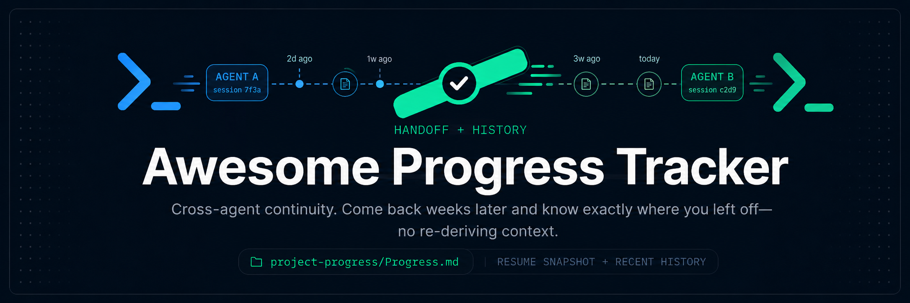

<div align="center">

  

### Resumable memory for Codex, Claude Code, and any MCP-compatible agent.

Project-local Markdown that survives context resets — so your agent picks up exactly where it left off, every session, in one file it can read in a few hundred tokens.

[](#license)
[](#choose-your-path)
[](#mcp-server)
[](#choose-your-path)
[](https://github.com/AndriiLavrekha/awesome-progress-tracker/releases/tag/v0.5.0)

[Why](#why) · [Features](#features) · [Quick Start](#choose-your-path) · [MCP Tools](#mcp-server) · [Troubleshooting](#troubleshooting-codex)

</div>

---

## Why

Agent sessions end. Context windows reset. New sessions start cold, burning the first few minutes re-deriving "what was I doing?"

Awesome Progress Tracker fixes that with one convention: every project keeps a `project-progress/Progress.md` file as its **resume source of truth**. A `SessionStart` hook injects the compact bits — Resume Snapshot, Next Action, Blockers — into the agent's context automatically. No dashboards, no databases. Just a Markdown file the agent reads at kickoff and updates before it stops.

```text
session 1 ──work──► Progress.md updated (Resume Snapshot · Next Action · Blockers)
                                │
new session ◄── SessionStart hook injects the snapshot, no lookup needed ──┘
```

## Features

- **🗂️ One file per project, human-readable** — plain Markdown you can read, edit, diff, and commit.
- **🔁 Automatic resume context** — `SessionStart` injects the Resume Snapshot and Next Action at kickoff.
- **Last runtime memo** — `Progress.md` records the provider, agent, model, and effort of the session that last updated it, and SessionStart repeats that line.
- **🛡️ Sensitive-commit guard** — blocks `git commit` when staged progress is marked `commit_progress: false` or `sensitivity: sensitive`.
- **⏰ Stop reminders** — flags when the working tree changed but `Progress.md` didn't, and scans for accidentally-committed secrets.
- **🧩 Works everywhere** — first-class plugins for Claude Code and Codex, plus an open-standard `SKILL.md` skill for Gemini CLI, Copilot, and Cursor.
- **🌐 Cross-project index via MCP** — answers "what am I working on?" across every tracked project (see [MCP Server](#mcp-server)).
- **🩺 Scriptable health checks** — `doctor --json` gives a non-zero exit code and a diagnostic report when setup is broken.

## Choose Your Path

| I use... | Install this way |
| --- | --- |
| **Claude Code** | [Claude Code plugin](#install-as-a-claude-code-plugin-recommended) — zero-config, one marketplace add |
| **Codex** | [Codex plugin](#install-as-a-codex-plugin-recommended) — native plugin flow, no `config.toml` editing |
| **Hermes Agent** | [Hermes install](#install-for-hermes-agent) — Skill + MCP only; lifecycle hooks are deferred |
| **Gemini CLI / Copilot / Cursor** | Drop `skills/project-progress/SKILL.md` into `~/.agents/skills` or a repo's `.agents/skills` |
| **MCP client or CLI only** | [Manual install](#initialize-a-project) and, if needed, [MCP Server](#mcp-server) |

> Requires Node.js >= 18. Hooks and MCP server run entirely on Node — no Python needed.

After installing a plugin, start a new agent session. Run `awesome-progress-tracker doctor -g codex` (or `--json` for scripting) to check setup.

## Install As A Claude Code Plugin (recommended)

Zero-config: one marketplace add + install wires the skill, MCP server, and lifecycle hooks — no edits to `CLAUDE.md` or `~/.claude.json`.

```text
/plugin marketplace add AndriiLavrekha/awesome-progress-tracker
/plugin install project-progress@awesome-progress-tracker
```

Or from the CLI:

```bash
claude plugin marketplace add AndriiLavrekha/awesome-progress-tracker
claude plugin install project-progress@awesome-progress-tracker
```

What you get (restart the session to load it):

| Piece | What it does |
| --- | --- |
| **Skill** `project-progress` | Guides the agent to maintain `project-progress/` during work |
| **Command** `/project-progress:init [name]` | Initializes tracking in the current repo |
| **MCP server** `project-progress` | `list/refresh/read/update/mark` tools over a cross-project index |
| **`SessionStart` hook** | Injects the Resume Snapshot / Next Action as context |
| **`PreToolUse` hook** | Blocks `git commit` on progress marked `commit_progress: false` or `sensitivity: sensitive` |
| **`Stop` hook** | Reminds you to update progress (and flags secrets) when the tree changed but `Progress.md` didn't |

To scope the MCP index to specific roots, set `PROJECT_PROGRESS_ROOTS` (semicolon-separated) in the environment Claude Code runs in.

> Ships prebuilt `dist/`, so it runs straight from the cloned repo with no build step.

## Install As A Codex Plugin (recommended)

The same repo is also a Codex plugin — installs through the native flow, no manual `config.toml` editing:

```bash
codex plugin marketplace add AndriiLavrekha/awesome-progress-tracker
codex plugin add project-progress@awesome-progress-tracker
```

This wires the same skill, MCP server, and lifecycle hooks as the Claude Code plugin. Restart Codex after installing or updating so the manifest, MCP server, and hooks reload.

> [!NOTE]
> Codex doesn't auto-trust plugin-bundled hooks: the first time `SessionStart` / `PreToolUse` / `Stop` fire, Codex asks you to review and trust them. Approve once.

<details>
<summary><strong>Upgrade the plugin</strong></summary>
<br>

**Codex**

```bash
codex plugin marketplace upgrade
codex plugin add project-progress@awesome-progress-tracker
codex plugin list
```

Start a new Codex session afterward. If prompted, review and trust the updated hooks in `/hooks`.

**Claude Code**

```bash
claude plugin update project-progress@awesome-progress-tracker
claude plugin list
```

Restart Claude Code so the plugin's skills, MCP server, and hooks reload.

</details>

On an initialized project, `SessionStart` injects resume context from `Progress.md`. On an uninitialized project, the agent asks before creating `project-progress/`:

```text
This project is not initialized with Awesome Progress Tracker. Do you want me to create `project-progress/` here?
```

- **Yes** → run `awesome-progress-tracker init . --project "<name>"`
- **No** → record an opt-out so future sessions stay quiet:

```bash
awesome-progress-tracker state set . --state opted-out
```

The opt-out lives outside the repo, under the tool's user data directory — it never dirties the project.

Because skills follow the open `SKILL.md` standard, the same skill also works in Gemini CLI, Copilot, and Cursor when placed under `~/.agents/skills` or a repo's `.agents/skills`.

## Install For Hermes Agent

Hermes Agent is supported today through the managed skill + MCP path: supported Skill + MCP installation with the `install`, `doctor`, and `uninstall` commands, plus `status` for inspection. lifecycle hooks are deferred for Hermes, so this path does not yet wire `SessionStart`, `PreToolUse`, or `Stop` automation.

If Hermes isn't installed yet, follow the [official Hermes Agent installation instructions](https://hermes-agent.nousresearch.com/docs/getting-started/installation), then confirm the CLI works:

```bash
hermes --version
```

Wire the integration:

```bash
npx github:AndriiLavrekha/awesome-progress-tracker install -g hermes
```

| Piece | What it does |
| --- | --- |
| **Skill** `project-progress` | Installed from the tagged raw GitHub `SKILL.md` |
| **MCP server** `awesome-progress-tracker` | Added via `hermes mcp add ...` with `PROJECT_PROGRESS_ROOTS` |
| **Doctor** | Checks Hermes CLI, skill, MCP presence, and `hermes mcp test awesome-progress-tracker` |
| **Uninstall** | Removes only the managed skill and MCP server |

Named collisions stop the install before any changes are made. If Hermes already has a `project-progress` skill or `awesome-progress-tracker` MCP server, remove or rename the existing entry first and rerun the installer.

After install or update, restart Hermes so it reloads the managed skill and MCP registry. Because lifecycle hooks are deferred for Hermes, drive things manually for now:

- initialize with `awesome-progress-tracker init . --project "<name>"` when the user opts in
- check setup with `awesome-progress-tracker status -g hermes` / `doctor -g hermes`
- verify directly with `hermes skills list --source hub`, `hermes mcp list`, `hermes mcp test awesome-progress-tracker`

## Initialize A Project

```bash
# after npm publication
npx awesome-progress-tracker init /path/to/repo --project "My Project"

# from the private GitHub repo
npx github:AndriiLavrekha/awesome-progress-tracker init /path/to/repo --project "My Project"

# or installed globally
npm install -g github:AndriiLavrekha/awesome-progress-tracker
project-progress init /path/to/repo --project "My Project"
```

`init` creates `project-progress/` from `templates/project-progress/`. Fill in the frontmatter and keep `Resume Snapshot`, `Next Action`, `Remaining Work`, and `Blockers` compact enough for an agent to load first.

<details>
<summary><strong>Agent Instructions — manual / CLI install path</strong></summary>
<br>

Install the global bootstrap for your agent (`claude` is the default; swap `-g codex` where shown). This installs global instructions telling the agent to check for `project-progress/Progress.md` at kickoff — it does **not** initialize every project automatically. It also configures the agent's MCP client (`~/.claude.json` for Claude Code, `~/.codex/config.toml` for Codex).

| Task | Command |
| --- | --- |
| Install | `npx github:AndriiLavrekha/awesome-progress-tracker install [-g codex]` |
| Install + verify | `... install [-g codex] --verify` |
| Install MCP config only | `... install-mcp [-g codex]` |
| Install MCP config, project-local | `... install-mcp --local --roots "."` (writes `.mcp.json`) |
| Scan other roots | `... install -g codex --roots "C:/Users/me/Documents;C:/Users/me/Projects"` |
| Check status | `... status [-g codex]` |
| Health check | `... doctor [-g codex]` |
| List opt-in/opt-out state | `... state list` |
| Set opt-out | `... state set /path/to/repo --state opted-out` |
| Reset state | `... state reset /path/to/repo` |
| Uninstall | `... uninstall [-g codex \| --local]` |

Replace `...` with `npx github:AndriiLavrekha/awesome-progress-tracker`.

Manual instruction files are also available:

- `skills/project-progress/SKILL.md` — install or reference for Codex
- `agent-instructions/AGENTS-snippet.md` — paste into a project or global AGENTS.md
- `agent-instructions/CLAUDE-snippet.md` — paste into Claude Code memory
- `agent-instructions/HOOKS.md` — lifecycle reminders and validation

Agents should update progress at kickoff when state changes, after milestones, when blockers appear, after verification, and before ending a meaningful session.

</details>

<details>
<summary><strong>Hook Check — run the lifecycle hook manually</strong></summary>
<br>

```powershell
# Windows
./hooks/project-progress-check.ps1 -ProjectRoot . -SessionStartedAt 2026-06-27T00:00:00+00:00 -MeaningfulWork -CompletionBoundary
```

```bash
# POSIX
./hooks/project-progress-check.sh --project-root . --session-started-at 2026-06-27T00:00:00+00:00 --meaningful-work --completion-boundary
```

These wrappers run the compiled hook (`dist/src/hook/cli.js`) on Node — run `npm run build` first (or install the published package, which builds on `prepare`). For direct use: `node dist/src/hook/cli.js --project-root . --session-started-at <iso>`.

</details>

## MCP Server

```bash
npx awesome-progress-tracker mcp                                # after npm publication
npx github:AndriiLavrekha/awesome-progress-tracker mcp           # from the private GitHub repo
```

Configure discovery with a semicolon-separated `PROJECT_PROGRESS_ROOTS`:

```powershell
$env:PROJECT_PROGRESS_ROOTS = "C:/Users/you/Documents;C:/Users/you/Projects"
npx github:AndriiLavrekha/awesome-progress-tracker mcp
```

For local development in this repo:

```bash
npm install
npm run build:mcp
node dist/src/mcp/server.js
```

MCP clients installed from npm/GitHub should use the package binary (`awesome-progress-tracker mcp` or `project-progress mcp`) to keep stdio clean.

**Tool surface** — deliberately small; administrative state lives in the CLI (`state list/set/reset`), not here:

| Tool | What it does |
| --- | --- |
| `list_projects` | List compact summaries from the cached index; optional `status` filter |
| `refresh_projects` | Rescan `PROJECT_PROGRESS_ROOTS` and update the index |
| `read_project_progress` | Read one project's compact progress summary |
| `update_project_progress` | Replace or append a named section in a project's `Progress.md` |
| `mark_project_status` | Update frontmatter `status` and `last_milestone` |

The server maintains a lightweight global index (`~/.awesome-progress-tracker/projects.json` and `Projects.md`) as a fast "what projects exist?" view. `Progress.md` remains the source of truth; `refresh_projects`, `init`, `update_project_progress`, and `mark_project_status` all keep the index in sync.

## Verification

<details>
<summary><strong>Manual and agent-led validation commands</strong></summary>
<br>

See `TESTING.md` and `agent-instructions/SELF-TEST.md` for full scenarios.

```bash
npm test
npm run build
```

Verify package creation and npx-style execution locally:

```bash
npm pack --dry-run
npm pack
npx --yes ./awesome-progress-tracker-0.1.0.tgz help
```

Run the lifecycle check against this repo:

```powershell
./hooks/project-progress-check.ps1 -ProjectRoot . -SessionStartedAt 2026-06-27T00:00:00+00:00 -MeaningfulWork -CompletionBoundary
```

</details>

## Troubleshooting Codex

<details>
<summary><strong>Codex doesn't ask about progress tracking in a new project</strong></summary>
<br>

Check in order:

1. Plugin installed and enabled: `codex plugin list`.
2. Hooks trusted: open `/hooks` in Codex and trust the `project-progress` hooks.
3. Restarted Codex/Claude Code (or new session) after install or update.
4. Project is actually uninitialized: `project-progress/Progress.md` is missing.
5. Project isn't opted out: `awesome-progress-tracker state list`; reset with `state reset .`.
6. Task is non-trivial: hooks only nudge for multi-step feature/investigation/refactor/setup/debugging/deployment/release work.
7. MCP is running: `/mcp` in Codex or `awesome-progress-tracker doctor -g codex`.

The prompt-time hook covers work submitted after startup — if the project was created mid-session, submit the next prompt after trusting the updated hook.

Hooks are best-effort and never block normal Codex operation. If hooks are disabled or untrusted, the `project-progress` skill and bootstrap instructions still define the workflow.

</details>

## Contributing

Private, single-maintainer repo for now. See [`AGENTS.md`](AGENTS.md) for structure/conventions and [`TESTING.md`](TESTING.md) for the verification workflow before opening a PR.

<details>
<summary><strong>Project layout</strong></summary>
<br>

Each project owns its own progress files — global vaults, dashboards, and MCP tools may read or summarize them, but the source of truth is always the `project-progress/` folder inside each project.

| Path | What lives there |
| --- | --- |
| `templates/project-progress/` | Canonical Markdown templates for new projects |
| `skills/project-progress/SKILL.md` | Cross-tool skill instructions for maintaining progress |
| `agent-instructions/` | Reusable AGENTS.md, Claude Code, and hook guidance snippets |
| `src/hook/` | TypeScript progress validation and lifecycle hook checks (compiled to `dist/`) |
| `hooks/` | PowerShell and POSIX wrappers that run the compiled hook on Node |
| `src/mcp/` | TypeScript MCP server over project-local progress files |
| `.claude-plugin/`, `.mcp.json`, `hooks/hooks.json`, `commands/` | The Claude Code plugin |
| `.codex-plugin/`, `.agents/plugins/marketplace.json`, `.mcp.codex.json`, `hooks/hooks-codex.json` | The Codex plugin (same skill and `dist/` adapter, Codex-specific config) |

</details>

## License

MIT — see the `license` field in [`package.json`](package.json).
